# ClubApp Database Architecture Report

This document outlines the database schema and relationships for the NEC Club Management System.

## 📊 Entity Relationship Diagram (ERD)

```mermaid
erDiagram
    COLLEGE ||--o{ CLUB : "manages"
    USERS ||--o{ CLUB : "coordinates"
    CLUB ||--o{ EVENT : "hosts"
    CLUB ||--o{ CLUB_JOIN_REQUEST : "receives"
    USERS ||--o{ CLUB_JOIN_REQUEST : "sends"
    USERS ||--o{ ATTENDANCE : "marks"
    EVENT ||--o{ ATTENDANCE : "tracks"
    CLUB ||--o{ NEWS : "posts"

    USERS {
        Long id PK
        String name
        String email UK
        String password
        Enum role "ADMIN, COORDINATOR, STUDENT"
        String department
        String year
    }

    CLUB {
        Long id PK
        String name
        String department "ALL or specific code"
        String description
        String vision
        String mission
        Integer foundedYear
        String logoImage
        Long coordinator_id FK
    }

    EVENT {
        Long id PK
        String name
        String description
        String venue
        LocalDate date
        LocalTime time
        String posterImage
        Integer maxAttendees
        Boolean membersOnly
        String winners
        Long club_id FK
    }

    ATTENDANCE {
        Long id PK
        Long event_id FK
        Long user_id FK
        LocalDateTime markedAt
    }

    CLUB_JOIN_REQUEST {
        Long id PK
        Long club_id FK
        Long user_id FK
        String message
        Enum status "PENDING, ACCEPTED, REJECTED"
        LocalDateTime requestedAt
    }

    NEWS {
        Long id PK
        String title
        String content
        Long club_id FK
        LocalDateTime postedAt
    }

    COLLEGE {
        Long id PK
        String collegeName
        String logoImage
        String aboutText
        String vision
        String mission
    }
```

## 🔑 Key Relationships & Constraints

### 1. User Roles & Hierarchy
*   **ADMIN**: Global access. Can delete any entity.
*   **COORDINATOR**: Linked to a specific **CLUB** via `coordinator_id`. Manages events and news for that club.
*   **STUDENT**: Can join clubs and register for events.

### 2. Club & Department Mapping
*   Clubs like **NCC** or **NSS** use the department code `ALL`. This makes their news and events visible across all departments.
*   Standard clubs (e.g., **CSE Club**) use specific department codes (CSE, ECE, etc.).

### 3. Event & Attendance (The Most Critical Link)
*   The `attendance` table acts as a bridge between **USERS** and **EVENTS**.
*   **Constraint**: An event cannot be deleted if attendance records exist, unless those records are cleared first (Handled in `EventService.java`).

### 4. Join Requests
*   Used to manage club membership. When a request is `ACCEPTED`, the user is added to the club's member list in the application logic.

## 🛠️ Data Integrity (Cascading)
To prevent "Foreign Key Constraint" errors, the system implements manual cascading in the Service layer:
*   **Deleting a Club**: Clears all join requests, then clears all attendance for all club events, then deletes the events, and finally deletes the club.
*   **Deleting an Event**: Clears all associated attendance records first.

---
*Report Generated: 2026-04-27*
